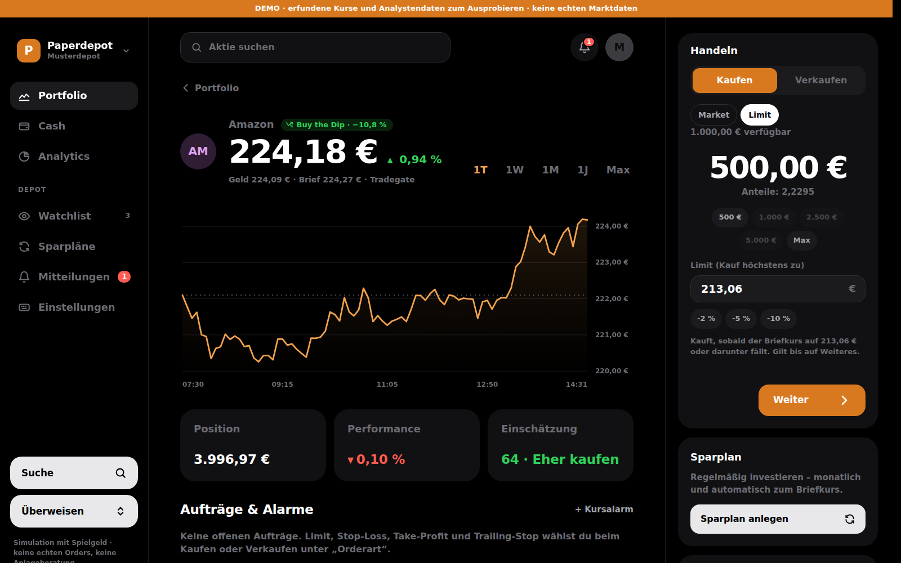
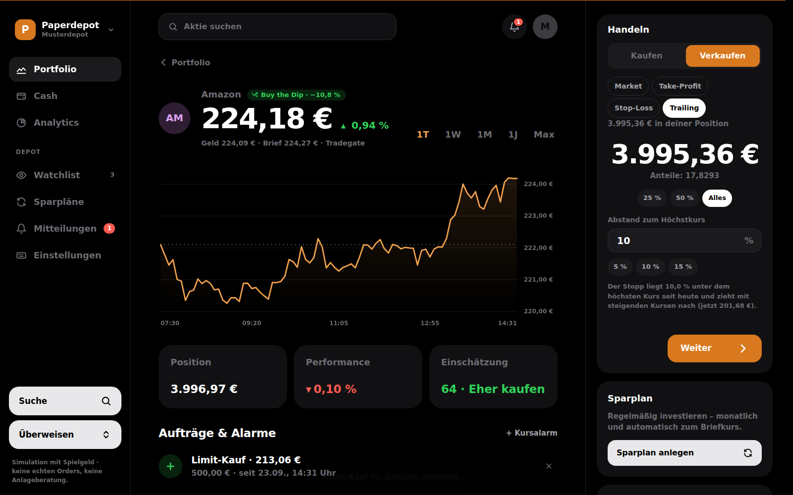
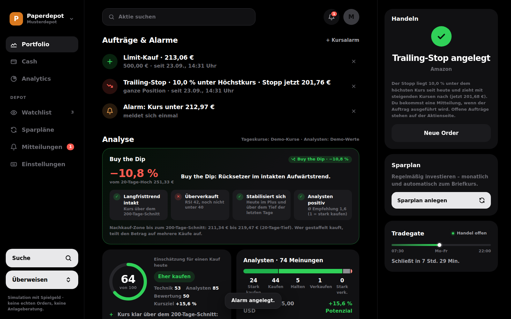
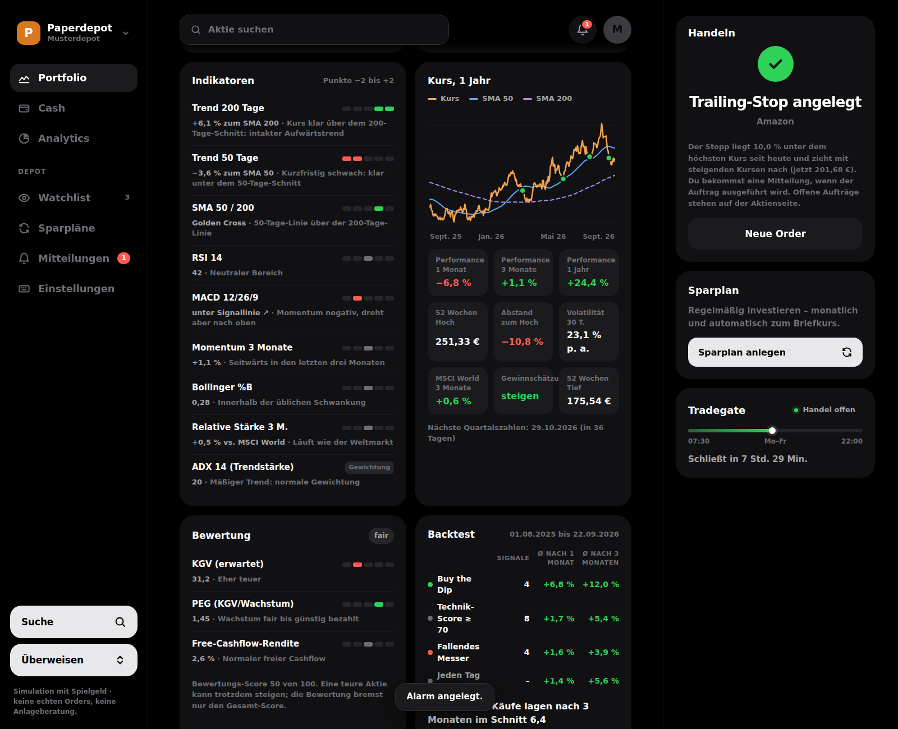
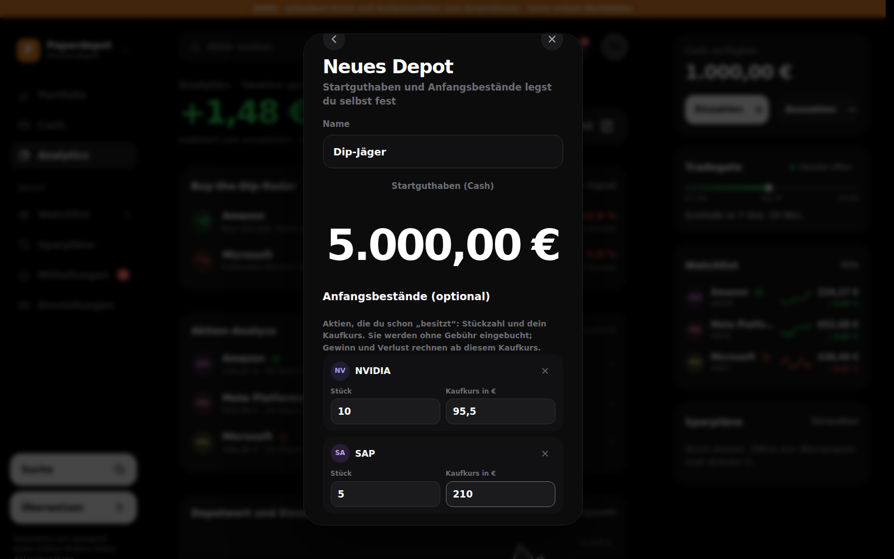
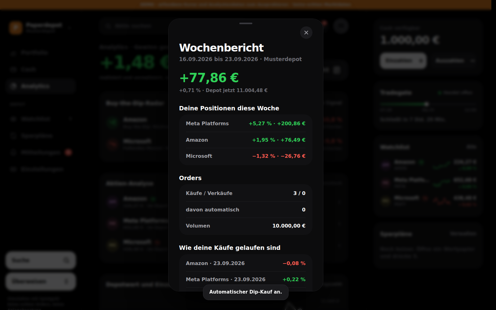
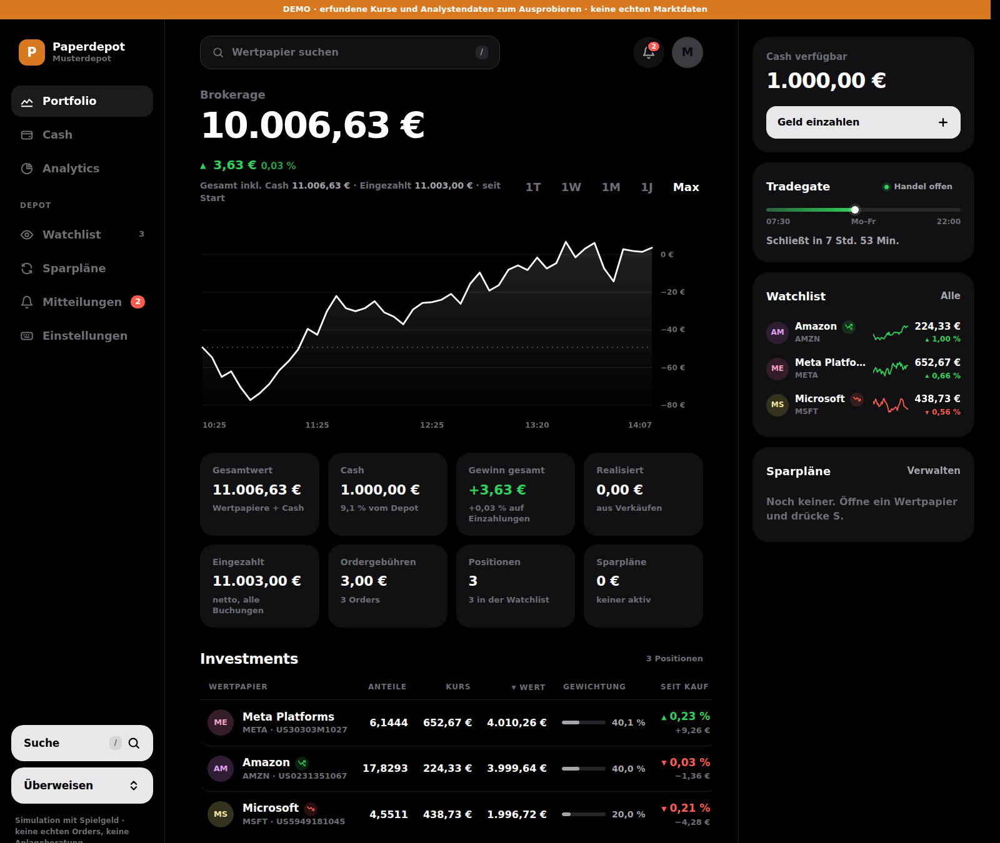
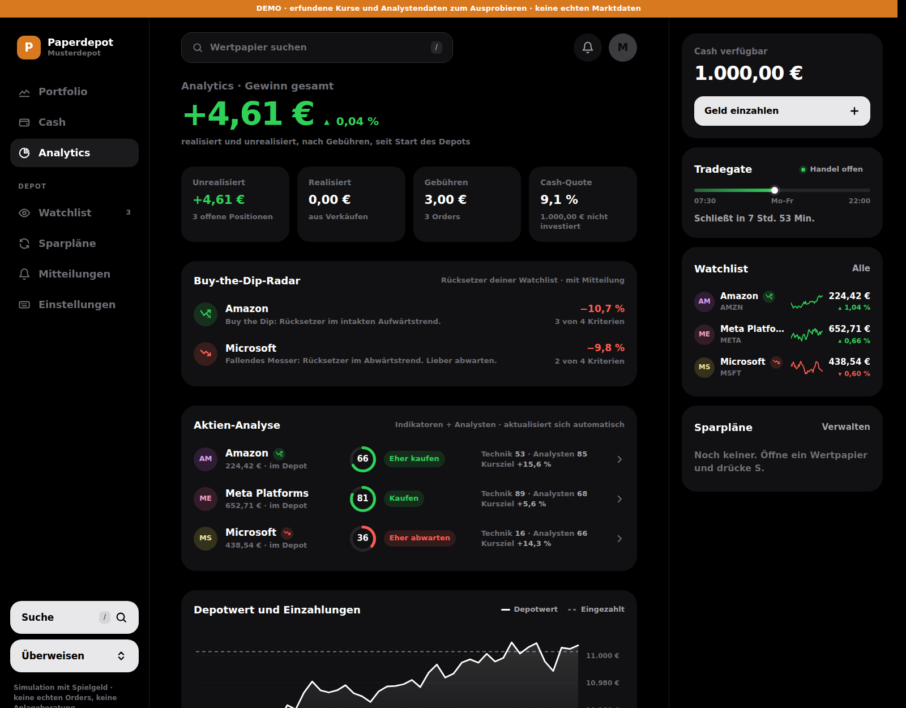

# Paperdepot

Ein Übungs-Broker im Stil von Trade Republic: Live-Kurse von Tradegate, Cash-Konto,
Kauf/Verkauf, Sparpläne und eine **Analyse je Aktie**. Die Analyse fasst technische
Indikatoren und Analystenmeinungen zu einer Kauf-Einschätzung zusammen.
Alles läuft mit Spielgeld. Es werden keine echten Orders ausgeführt, und die App ist keine Anlageberatung.

```bash
python depot_live.py            # http://localhost:8765
python depot_live.py --offen    # auch vom Handy im selben WLAN
python depot_live.py --demo     # ohne Internet: erfundene Kurse, eigenes Demo-Depot in demo/
```

Voraussetzung ist nur Python 3.9+. Zusätzliche Pakete braucht es nicht.

## Dateien

| Datei | Inhalt |
|---|---|
| `depot_live.py` | Server, Kurse, Orders, Sparpläne, Aufträge, Mitteilungen |
| `analyse.py` | Indikatoren, Analysten, Bewertung, Score, Buy the Dip, Backtest |
| `auftraege.py` | Limit, Stop-Loss, Take-Profit, Trailing-Stop, Kursalarme |
| `depots.py` | Mehrere Depots mit eigenen Anfangsbeständen |
| `bericht.py` | Wochenbericht |
| `katalog.py` | 40 bekannte Aktien (USA, Deutschland, Europa) für die Suche |
| `demo.py` | Demo-Kurse und Demo-Analystenwerte |
| `web/` | Oberfläche und App-Dateien (Manifest, Service Worker, Icons) |
| `tests/` | Automatische Tests: `python -m unittest` |
| `screenshots/` | Beispiele im Demo-Modus |

## Mehrere Depots

Über den Depotnamen oben links (am Handy: Profil → Depots) kannst du Depots wechseln, neu anlegen,
umbenennen und löschen. Beim Anlegen legst du selbst fest:
- das **Startguthaben** (Cash),
- die **Anfangsbestände**: Aktie, Stückzahl und dein Kaufkurs. Sie werden ohne Gebühr eingebucht,
  und Gewinn und Verlust rechnen ab diesem Kaufkurs.

Jedes Depot hat eigenes Cash, eigene Positionen, Watchlist, Sparpläne, Aufträge und Mitteilungen.
Die Dateien liegen in `depots/<name>/`. Ein bestehendes `depot.json` wird beim ersten Start
automatisch als „Hauptdepot“ dorthin verschoben.

**Geld abziehen:** Auf der Cash-Seite und rechts oben gibt es *Einzahlen* und *Auszahlen*.

## Orderarten und Alarme

| Orderart | Was passiert |
|---|---|
| Market | sofort zum aktuellen Brief- bzw. Geldkurs |
| Limit (Kauf) | kauft, sobald der Briefkurs auf das Limit oder darunter fällt |
| Take-Profit | verkauft, sobald der Geldkurs das Limit erreicht |
| Stop-Loss | verkauft, sobald der Geldkurs auf den Stopp oder darunter fällt |
| Trailing-Stop | Stop-Loss mit festem Abstand in %, der mit steigenden Kursen nach oben wandert |

Alle Aufträge außer Market gelten bis auf Weiteres. Ausgeführt wird dann zum aktuellen Kurs und
nur, solange das Programm läuft. Offene Aufträge stehen auf der Aktienseite und lassen sich dort löschen.

**Kursalarme:** Mitteilung, wenn der Kurs über oder unter einen Wert geht. Das gilt einmal. Eine
dritte Variante meldet, wenn sich die Einschätzung ändert, und bleibt aktiv.

**Automatischer Dip-Kauf** (Analytics → Buy-the-Dip-Radar): Bei jedem neuen Buy-the-Dip-Signal
kauft das Programm für einen festen Betrag, höchstens bis zur gewählten Monatsgrenze.

## Welche Aktien lassen sich kaufen?

Kaufen lässt sich jede Aktie (und jeder ETF) mit ISIN, die an Tradegate gehandelt wird.
Über die Suche findest du 40 bekannte Werte direkt; alles andere fügst du per ISIN hinzu. Mit
Internet ergänzt die Yahoo-Suche Name und Kürzel. Neue Aktien landen auf der Watchlist, bekommen
Live-Kurse und eine eigene Analyse. Entfernen geht, solange du keine Position und keinen Sparplan
darin hast.

## Analyse je Aktie: so entsteht die Einschätzung

**Technik (45 %)**: acht Indikatoren aus rund 500 Tageskursen, je −2 bis +2 Punkte:

| Indikator | Positiv, wenn … |
|---|---|
| Trend 200 Tage (Gewicht 1,5) | Kurs über dem 200-Tage-Schnitt |
| Trend 50 Tage | Kurs über dem 50-Tage-Schnitt |
| SMA 50/200 | Golden Cross (50 über 200) |
| RSI 14 | unter 40 (überverkauft), negativ über 60/70 |
| MACD 12/26/9 | Histogramm positiv und steigend |
| Momentum 3 Monate | Plus über 3 bzw. 10 % |
| Bollinger %B (Gewicht 0,5) | nahe/unter dem unteren Band |
| Relative Stärke 3 Monate | besser als der MSCI World (in Euro) |

Der **ADX** (Trendstärke) verteilt die Gewichte: In einem starken Trend (ADX ≥ 25) zählen die
Trendsignale mehr und RSI/Bollinger weniger. Ohne klaren Trend (ADX < 20) ist es umgekehrt.

**Analysten (35 %)** setzt sich so zusammen:
- Durchschnittliche Empfehlung (45 %)
- Kurspotenzial bis zum Kursziel (30 %)
- **Gewinnrevisionen** (25 %): Wie viele Analysten ihre Gewinnschätzung in den letzten 30 Tagen
  angehoben oder gesenkt haben, und wie sich die Schätzung seit 90 Tagen verändert hat.

**Bewertung (20 %)**: Ist die Aktie teuer oder günstig? Gemessen am Kurs-Gewinn-Verhältnis (KGV)
auf Basis der erwarteten Gewinne, am PEG (KGV im Verhältnis zum Wachstum) und an der
Free-Cashflow-Rendite. Fehlt ein Teil, wird er weggelassen und die anderen zählen entsprechend mehr.

**Urteil** nach Score: ab 70 *Kaufen*, ab 58 *Eher kaufen*, ab 42 *Neutral*, ab 30 *Eher abwarten*,
darunter *Nicht kaufen*. Stehen **Quartalszahlen** in den nächsten 7 Tagen an, erscheint eine Warnung.

## Buy the Dip

Ein Rücksetzer liegt vor, wenn der Kurs mindestens 5 % unter dem 20-Tage-Hoch liegt. Bei stark
schwankenden Aktien wird die Schwelle entsprechend höher angesetzt. Dann prüft die App vier Kriterien:

1. Der Langfristtrend ist intakt: Der Kurs liegt über dem 200-Tage-Schnitt, oder der Schnitt steigt noch.
2. Die Aktie ist überverkauft: RSI unter 40.
3. Der Kurs stabilisiert sich: heute im Plus und über dem Tief der letzten Tage.
4. Die Analysten sind positiv: Ø Empfehlung 2,5 oder besser.

Daraus ergibt sich eines von drei Signalen:

| Zeichen | Bedeutung |
|---|---|
| 🟢 **Buy the Dip** | Trend intakt und mindestens 3 der 4 Kriterien erfüllt |
| 🟠 **Rücksetzer** | Trend intakt, aber noch nicht reif: beobachten |
| 🔴 **Fallendes Messer** | Rücksetzer im Abwärtstrend: lieber abwarten |

Das Zeichen erscheint an diesen Stellen:
- neben dem Namen im Portfolio, in der Watchlist, in der Suche und in Analytics
- im Buy-the-Dip-Radar auf der Analytics-Seite
- im Kopf der Aktienseite
- beim Kauf unter „Order prüfen“

Die Aktienseite zeigt außerdem die vier Kriterien einzeln und eine Nachkauf-Zone.

**Mitteilungen:** Wird eine Aktie zu *Buy the Dip* oder zum *fallenden Messer*, erscheint eine
Mitteilung. Das Signal muss dafür drei Kursabfragen in Folge bestehen, damit es nicht bei jedem
Kurszucken meldet. Dasselbe gilt für Quartalszahlen in den nächsten 3 Tagen. Die Mitteilung kommt
als Glocke mit Zähler, als Einblendung in der App und, falls im Browser erlaubt, als
Desktop-Mitteilung. Desktop-Mitteilungen gehen nur über `http://localhost`, nicht übers WLAN mit `--offen`.

## Backtest

Auf der Aktienseite prüft der Backtest die letzten rund 1,2 Jahre. Er beantwortet die Frage: Was
wäre nach 1 und nach 3 Monaten herausgekommen, wenn man bei jedem Buy-the-Dip-Signal, bei jedem
Technik-Score ab 70 oder bei jedem fallenden Messer gekauft hätte? Zum Vergleich steht ein Kauf an
irgendeinem Tag. Die Buy-the-Dip-Tage erscheinen als grüne Punkte im Jahres-Chart. Die Signale
entstehen dabei nur aus Kursen, weil die Analystenmeinungen von damals unbekannt sind. Wenige
Signale bedeuten ein unsicheres Ergebnis.

## Wochenbericht und App

- **Wochenbericht** (Analytics oder Mitteilung jeden Montag): Er zeigt:
  - die Veränderung des Depots in der Woche
  - die Positionen und Orders der Woche
  - wie jeder Kauf seitdem gelaufen ist
  - einen Vergleich: Käufe mit Score ab 58 gegen Käufe darunter
  - die aktuellen Buy-the-Dip-Chancen
- **Als App aufs Handy:** Im Browser „Zum Startbildschirm hinzufügen“ wählen. Die App bekommt ein
  eigenes Icon und läuft ohne Browserleiste.

### Automatik

- Live-Kurse: alle 15 s von Tradegate. Die Indikatoren und das Dip-Signal rechnen den heutigen Kurs laufend mit ein.
- Tageskurse inkl. MSCI World: alle 6 h von Yahoo Finance (Xetra, Euro). Ohne Verbindung dienen die eigenen
  Aufzeichnungen aus `papiere.csv` als Ersatz, und nach 15 min folgt ein neuer Versuch.
- Aufträge, Alarme und automatischer Dip-Kauf: bei jeder Kursabfrage (alle 15 s).
- Analystendaten, Revisionen, Bewertung und Zahlentermine: alle 12 h von Yahoo Finance. Ohne Verbindung wird nach 30 min neu versucht.
- Sparpläne: werden am Ausführungstag während der Handelszeit ausgeführt, solange das Programm läuft.

## Beispiel (Demo-Modus)

| | |
|---|---|
|  |  |
|  |  |
|  |  |
|  |  |
