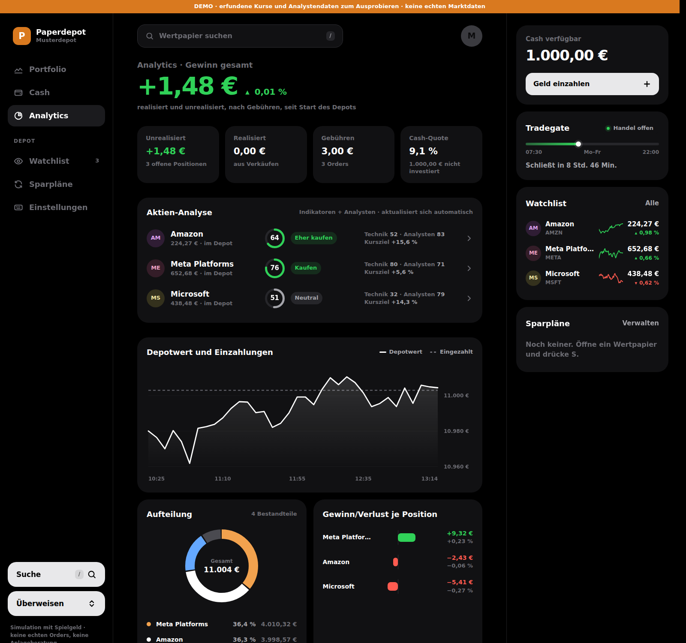
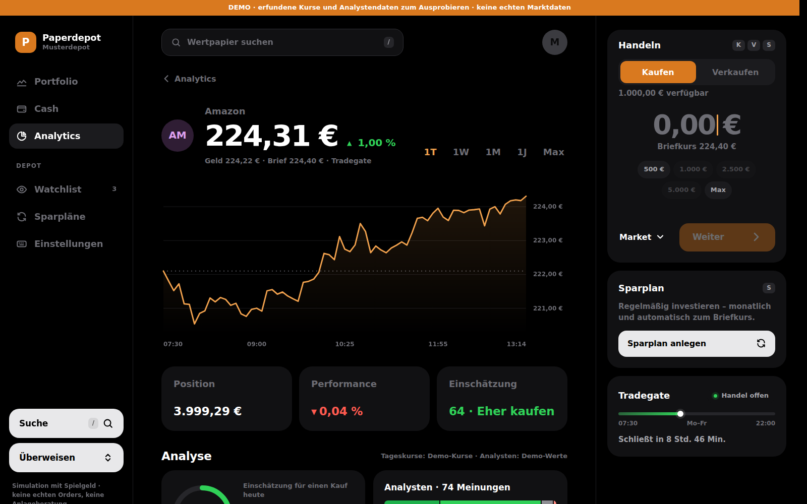
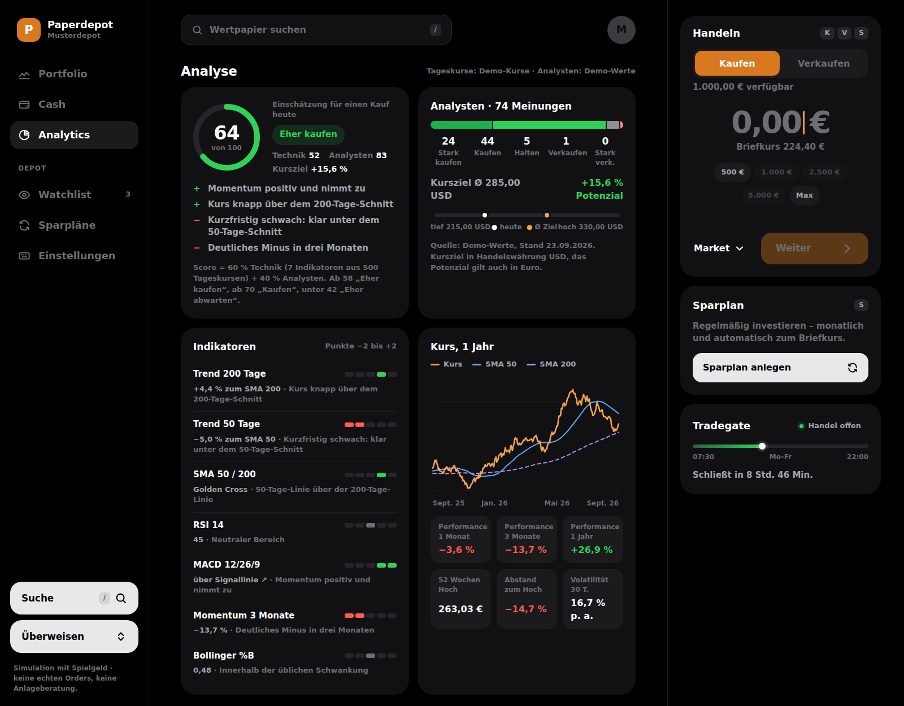
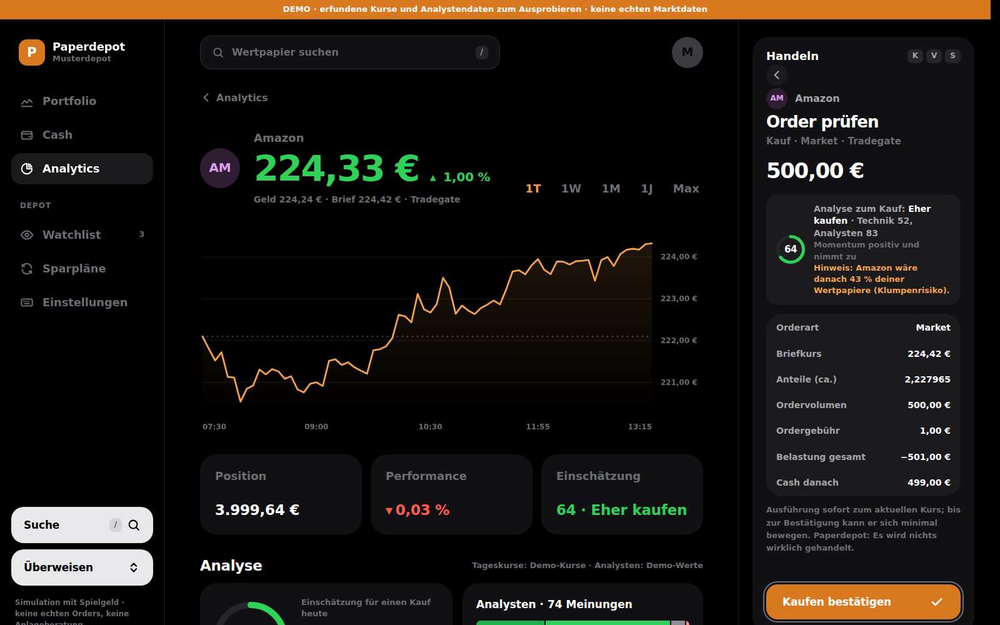
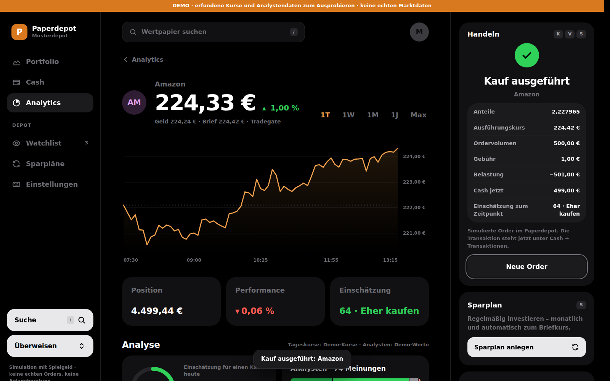
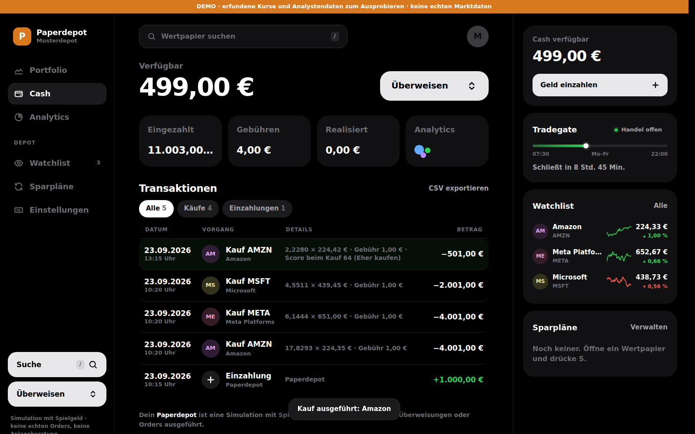

# Paperdepot

Ein Übungs-Broker im Stil von Trade Republic: Live-Kurse von Tradegate, Cash-Konto,
Kauf/Verkauf, Sparpläne und eine **Analyse je Aktie**. Die Analyse fasst technische
Indikatoren und Analystenmeinungen zu einer Kauf-Einschätzung zusammen.
Alles läuft mit Spielgeld. Es werden keine echten Orders ausgeführt, und die App ist keine Anlageberatung.

```bash
python depot_live.py            # http://localhost:8765
python depot_live.py --offen    # auch vom Handy im selben WLAN
python depot_live.py --demo     # ohne Internet: erfundene Kurse, eigenes Demo-Depot in demo/
```

Voraussetzung ist nur Python 3.9+. Zusätzliche Pakete braucht es nicht.

## Dateien

| Datei | Inhalt |
|---|---|
| `depot_live.py` | Server, Kurse, Orders, Sparpläne, Verlauf |
| `analyse.py` | Indikatoren, Analystendaten, Score und Urteil |
| `demo.py` | Demo-Kurse und Demo-Analystenwerte |
| `web/` | Oberfläche (`index.html`, `style.css`, `app.js`) |
| `screenshots/` | Beispiel: Kauf von Amazon (Demo-Modus) |

## Analyse je Aktie: so entsteht die Einschätzung

**Technik (60 %)**: sieben Indikatoren aus rund 500 Tageskursen. Jeder bekommt −2 bis +2 Punkte:

| Indikator | Positiv, wenn … |
|---|---|
| Trend 200 Tage (Gewicht 1,5) | Kurs über dem 200-Tage-Schnitt |
| Trend 50 Tage | Kurs über dem 50-Tage-Schnitt |
| SMA 50/200 | Golden Cross (50 über 200) |
| RSI 14 | unter 40 (überverkauft), negativ über 60/70 |
| MACD 12/26/9 | Histogramm positiv und steigend |
| Momentum 3 Monate | Plus über 3 bzw. 10 % |
| Bollinger %B (Gewicht 0,5) | nahe/unter dem unteren Band |

**Analysten (40 %)**: die durchschnittliche Empfehlung (1 = stark kaufen … 5 = stark verkaufen)
und das Kurspotenzial bis zum mittleren Kursziel (±25 % ergeben die volle Punktzahl).

**Urteil** nach Score: ab 70 *Kaufen*, ab 58 *Eher kaufen*, ab 42 *Neutral*, ab 30 *Eher abwarten*,
darunter *Nicht kaufen*. Fehlen Analystendaten, zählt nur die Technik.

Die Einschätzung erscheint an vier Stellen:
- auf der Aktienseite (Karte „Einschätzung“ und Block „Analyse“),
- auf der Analytics-Seite als Übersicht aller Aktien,
- beim Kauf unter „Order prüfen“, mit Hinweis auf Klumpenrisiko ab 40 % Depotanteil,
- in der Transaktion selbst: Der Score zum Kaufzeitpunkt wird gespeichert.

### Automatik

- Live-Kurse: alle 15 s von Tradegate. Die Indikatoren rechnen den heutigen Kurs laufend mit ein.
- Tageskurse: alle 6 h von Yahoo Finance (Xetra, Euro). Ohne Verbindung dienen die eigenen
  Aufzeichnungen aus `papiere.csv` als Ersatz, und nach 15 min folgt ein neuer Versuch.
- Analystendaten: alle 12 h von Yahoo Finance. Ohne Verbindung wird nach 30 min neu versucht.
- Sparpläne: werden am Ausführungstag während der Handelszeit ausgeführt, solange das Programm läuft.

## Beispiel: Amazon kaufen (Demo-Modus)

| | |
|---|---|
|  |  |
|  |  |
|  |  |
